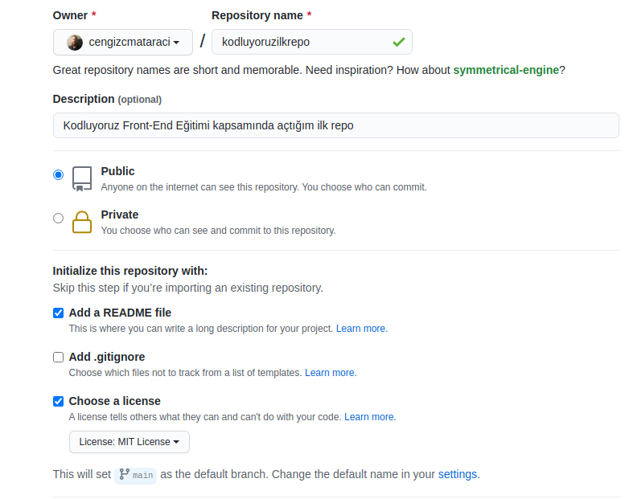

# Kodluyoruz ilk repo

Bu repo Kodluyoruz Front-End Eğitiminde oluşturduğum ilk repo. İçerisinde bir adet README dosyası, bir adet png dosyası, bir adet de index.html barındırıyor.

## Installation

Öncelikle projeyi clonelayın.

```
https://github.com/saliha99/kodluyoruzilkrepo.git
```

## Usage

Projeyi cloneladıktan sonra Visual Studio Code programında açınız.

Linux için:

```
cd kodluyoruzilkrepo
code .
```

## Contribuiting

Pull requestler kabul edilir. 

## Licence

[MIT](https://choosealicense.com/licenses/mit/)


